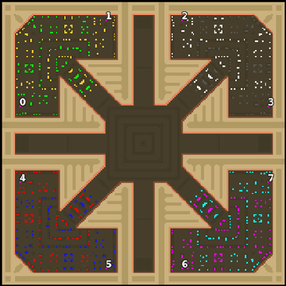

> **ARCHIVED**: This is an archive of an old map / mod from the old Addons site.

### [Map]

> [!IMPORTANT]
> This is an old map format. **Updated versions of maps are available in the Warzone 2100 Maps Database.**

# Mero_Star

| | |
| - | - |
| __Author:__ | Merowingg |
| Addon-type: | __Map__ |
| __Game Version:__ | 3.1.0 |
| Created: | March 31, 2013, 7:44 a.m. |
| Oil: | High |
| Players: | 8 |
| Bases: | Advanced Bases |
| __License:__ | CC-BY-SA-3.0 OR GPL-2.0-or-later |

> File: [8cMero_Star.wz](https://github.com/Warzone2100/old-addons-site/raw/main/assets/80/8cMero_Star.wz)  
> SHA256: 8ba7c8022e7d8446da4ea1458bed6057f7d95ab4aaedfbf9333200705b7e188d

## Description:

Hello Gentlemen  

I have noticed a long time ago that players when in teams very often act on their own and do not care about what is happening with their team mates.. as a respond I have made this map  It is called a Star because it partly looks like star, as always according to me  but the most important thing is the layout of the bases.

As you can clearly see the bases of two players in each corner of the map are entirely mixed up. So the best way to win the game is to cooperate while playing with advanced bases, but when with advanced bases off you have to kindly share the oil at your valley and the passage to it  

The map is so designed that if one of the players quits the game, the other still can properly defend himself  

The map is 200 x 200, for 8 players, it is 2v2v2v2 or 4v4, or 1v(any number). There is 25 oils in one combined base and another 15 in the passage and around the map. So it is 20 oils per player. Advanced bases are included.

The entire base look impressive and is not extremely heavily fortified although it has nice features here there and everywhere  

Also remember that on my maps there might be some hidden places many may not think about  I am not promising you will find anything there but still remember to travel around  

!!! The map cannot be played 1v1 while inside the same valley. The reason is simple the bases are extrememly mixed up so all the defences will immediatelly start shooting at each other, and then on just produced units. Please have it on mind!!!

Have fun gentlemen  

