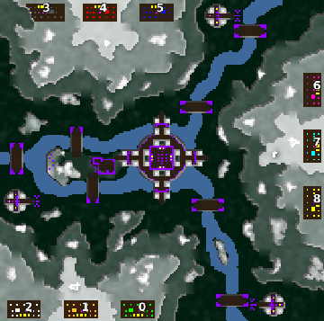

> **ARCHIVED**: This is an archive of an old map / mod from the old Addons site.

### [Map]

> [!IMPORTANT]
> This is an old map format. **Updated versions of maps are available in the Warzone 2100 Maps Database.**

# DA-scav-isle

| | |
| - | - |
| __Author:__ | duda |
| Addon-type: | __Map__ |
| __Game Version:__ | 3.1.0 |
| Created: | March 31, 2013, 4:27 p.m. |
| Oil: | Medium |
| Players: | 9 |
| Bases: | Normal bases |
| __License:__ | CC0-1.0 |

> File: [9cDAscavislev0.wz](https://github.com/Warzone2100/old-addons-site/raw/main/assets/82/9cDAscavislev0.wz)  
> SHA256: f66164ba9c0eac26eaf94bce6172cfb146a379b676c0e0dd407a7e5692843432

## Description:

3 vs 3 vs 3

8 oil per base + 17 from scavengers

