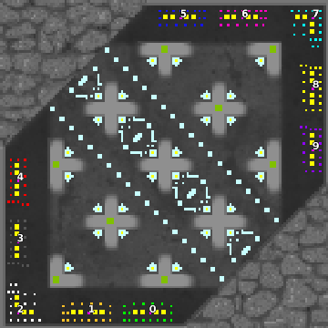

> **ARCHIVED**: This is an archive of an old map / mod from the old Addons site.

### [Map]

> [!IMPORTANT]
> This is an old map format. **Updated versions of maps are available in the Warzone 2100 Maps Database.**

# DA-plus

| | |
| - | - |
| __Author:__ | duda |
| Addon-type: | __Map__ |
| __Game Version:__ | 3.1.0 |
| Created: | March 31, 2013, 5:41 p.m. |
| Oil: | High |
| Players: | 10 |
| Bases: | Normal bases |
| __License:__ | CC0-1.0 |

> File: [10cDAplusv1.wz](https://github.com/Warzone2100/old-addons-site/raw/main/assets/85/10cDAplusv1.wz)  
> SHA256: 94b489754a2859f760d99897a900d198964a6a850fb22a54d35b9c96145a44a2

## Description:

5vs5 multiplayer map

16 oil per base + from scav + oil drums on the "pluses"

