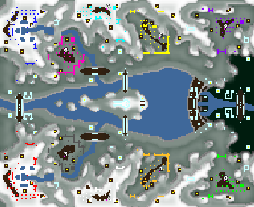

> **ARCHIVED**: This is an archive of an old map / mod from the old Addons site.

### [Map]

> [!IMPORTANT]
> This is an old map format. **Updated versions of maps are available in the Warzone 2100 Maps Database.**

# DA-mlake

| | |
| - | - |
| __Author:__ | duda |
| Addon-type: | __Map__ |
| __Game Version:__ | 3.1.0 |
| Created: | March 31, 2013, 4:27 p.m. |
| Oil: | Low |
| Players: | 10 |
| Bases: | Advanced Bases |
| __License:__ | CC0-1.0 |

> File: [10cDAmlakev1.wz](https://github.com/Warzone2100/old-addons-site/raw/main/assets/88/10cDAmlakev1.wz)  
> SHA256: 0d5359edeb5c6eb08f79fcd116931d4df2f786bdac7a78abc91579fa3b392962

## Description:

5 vs 5

6 oil per base + from scavs + oil drums

