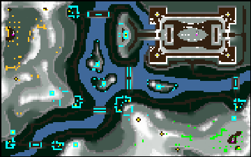

> **ARCHIVED**: This is an archive of an old map / mod from the old Addons site.

### [Map]

> [!IMPORTANT]
> This is an old map format. **Updated versions of maps are available in the Warzone 2100 Maps Database.**

# DA-castle-b3

| | |
| - | - |
| __Author:__ | duda |
| Addon-type: | __Map__ |
| __Game Version:__ | 3.1.0 |
| Created: | March 31, 2013, 4:27 p.m. |
| Oil: | Low |
| Players: | 3 |
| Bases: | Normal bases |
| __License:__ | CC0-1.0 |

> File: [3cDAcastleb3.wz](https://github.com/Warzone2100/old-addons-site/raw/main/assets/89/3cDAcastleb3.wz)  
> SHA256: bc4d5831dcbab2cea7c0ca18baa61437d076c6207dfe9e8ac6623dca76443903

## Description:

1 vs 1 vs 1 

4 oil per base

