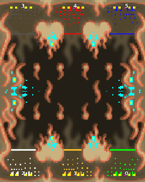

> **ARCHIVED**: This is an archive of an old map / mod from the old Addons site.

### [Map]

> [!IMPORTANT]
> This is an old map format. **Updated versions of maps are available in the Warzone 2100 Maps Database.**

# DA-firefight3x3

| | |
| - | - |
| __Author:__ | duda |
| Addon-type: | __Map__ |
| __Game Version:__ | 3.1.0 |
| Created: | March 31, 2013, 4:27 p.m. |
| Oil: | Medium |
| Players: | 6 |
| Bases: | Normal bases |
| __License:__ | CC0-1.0 |

> File: [6cDAfirefight3x3b.wz](https://github.com/Warzone2100/old-addons-site/raw/main/assets/94/6cDAfirefight3x3b.wz)  
> SHA256: 4e7db9e6bf3b4b33e887a2ac00f324dcc194264f0599146a22e87efe0c40f073

## Description:

3 vs 3 (firefight-map-collection) 

16 oil per base 

 + 2 per platau near base

 + 8 oil in the middel scav bases 

(beware of the scavs on startup)

