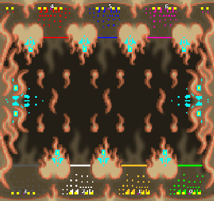

> **ARCHIVED**: This is an archive of an old map / mod from the old Addons site.

### [Map]

> [!IMPORTANT]
> This is an old map format. **Updated versions of maps are available in the Warzone 2100 Maps Database.**

# DA-firefight3x4

| | |
| - | - |
| __Author:__ | duda |
| Addon-type: | __Map__ |
| __Game Version:__ | 3.1.0 |
| Created: | April 1, 2013, 12:22 a.m. |
| Oil: | High |
| Players: | 7 |
| Bases: | Advanced Bases |
| __License:__ | CC0-1.0 |

> File: [7cDAfirefight3x4b.wz](https://github.com/Warzone2100/old-addons-site/raw/main/assets/95/7cDAfirefight3x4b.wz)  
> SHA256: f303d6796b5317a952ad7e428fbc28ce46b45872a54a2a83c3e4fec87d6af1cd

## Description:

3 vs 4 (firefight-map-collection) 

16 oil per base (+ 16 on top bases - its oil balanced) 

+ 2 per platau near base 

+ 8 oil in the middel scav bases 

(beware of the scavs on startup)

