> [!TIP]
> **If you want maps or mods for the latest version of Warzone 2100, please visit:**
> - **[The Warzone 2100 Maps Database](https://maps.wz2100.net)**

----------------------------------

# Archived Old Maps

## Maps:

**Page 1** | [Page 2](/oldmaps-2.md) | [Page 3](/oldmaps-3.md)

> [!IMPORTANT]
> The following maps are in old map formats intended for old versions of WZ.  
> **Updated versions of maps are available in the Warzone 2100 Maps Database.**

| Preview | Title | Players | Game Version | Author | Created |
| ------- | ----- | ------- | ------------ | ------ | ------- |
| 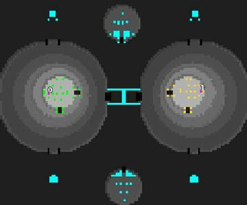 | [Battlehills](/assets/1/) | 2 | 3.1.0 | ayct | 2013-3-18 |
| 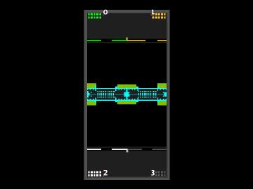 | [NTW2vs2VerSS](/assets/2/) | 4 | 3.1.0 | xxspecialsoulxx | 2013-3-18 |
| 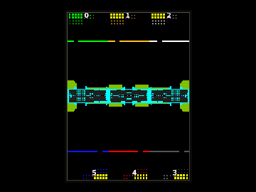 | [NTW3vs3VerSS](/assets/3/) | 6 | 3.1.0 | xxspecialsoulxx | 2013-3-18 |
|  | [hideous](/assets/9/) | 6 | 3.1.0 | tmp500 | 2013-3-19 |
| 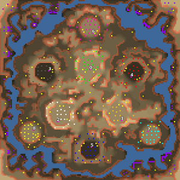 | [ambulant](/assets/10/) | 9 | 3.1.0 | tmp500 | 2013-3-19 |
| 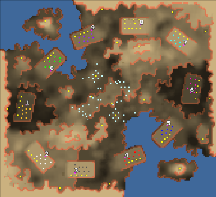 | [scramble](/assets/11/) | 10 | 3.1.0 | tmp500 | 2013-3-19 |
| 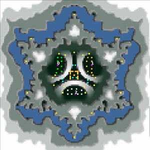 | [noway](/assets/12/) | 3 | 3.1.0 | tmp500 | 2013-3-19 |
| 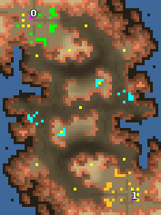 | [Breach](/assets/13/) | 2 | 3.1.0 | NoQ | 2013-4-1 |
| 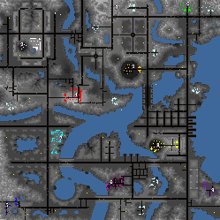 | [Riviera](/assets/14/) | 10 | 3.1.0 | NoQ | 2013-3-20 |
| 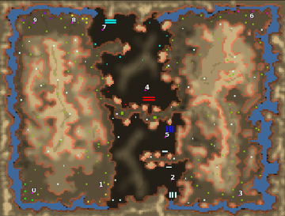 | [trash](/assets/18/) | 10 | 3.1.0 | tmp500 | 2013-3-21 |
|  | [bohoo](/assets/19/) | 6 | 3.1.0 | tmp500 | 2013-3-21 |
|  | [frowny](/assets/20/) | 5 | 3.1.0 | tmp500 | 2013-3-21 |
| 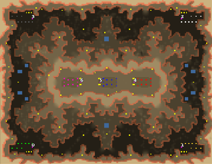 | [lowlife](/assets/21/) | 7 | 3.1.0 | tmp500 | 2013-3-21 |
| 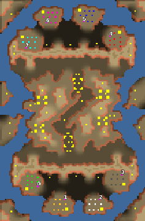 | [hallberry](/assets/22/) | 8 | 3.1.0 | tmp500 | 2014-5-12 |
|  | [mesh](/assets/23/) | 6 | 3.1.0 | tmp500 | 2013-3-21 |
| 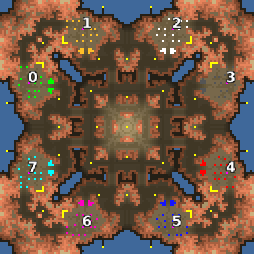 | [Desert Ruins](/assets/25/) | 8 | 3.1.0 | NoQ | 2013-4-1 |
|  | [Omega](/assets/26/) | 2 | 3.1.0 | NoQ | 2013-4-1 |
| 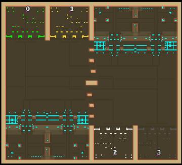 | [Mero_NTWScav](/assets/37/) | 4 | 3.1.0 | Merowingg | 2013-3-26 |
| 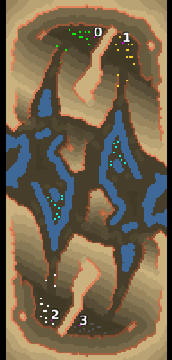 | [Mero_Eve1984](/assets/38/) | 4 | 3.1.0 | Merowingg | 2013-3-26 |
| 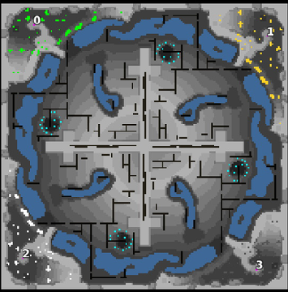 | [Mero_GhostCity](/assets/39/) | 4 | 3.1.0 | Merowingg | 2013-3-26 |
| 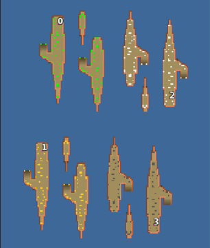 | [Mero_Ships](/assets/40/) | 4 | 3.1.0 | Merowingg | 2013-3-26 |
| 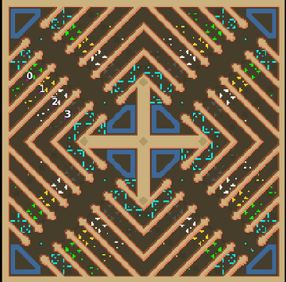 | [Mero_EagleEyes](/assets/41/) | 4 | 3.1.0 | Merowingg | 2013-3-26 |
| 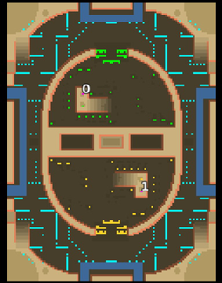 | [Mero_WarPill](/assets/42/) | 2 | 3.1.0 | Merowingg | 2013-3-26 |
| 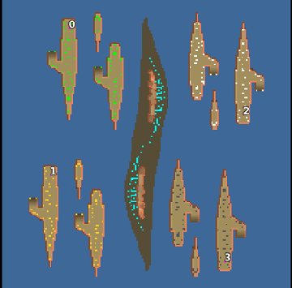 | [Mero_BattleShips](/assets/43/) | 4 | 3.1.0 | Merowingg | 2013-3-26 |
| 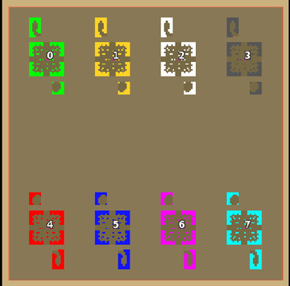 | [Mero_Simplicity](/assets/44/) | 8 | 3.1.0 | Merowingg | 2013-3-26 |
| 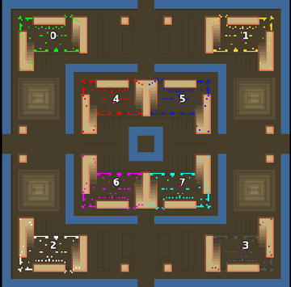 | [Mero_Inception](/assets/45/) | 8 | 3.1.0 | Merowingg | 2013-3-26 |
| 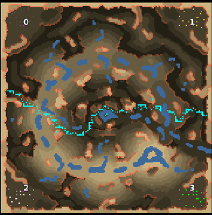 | [Mero_DragonTail2](/assets/47/) | 4 | 3.1.0 | Merowingg | 2013-3-26 |
|  | [Mero_Negative](/assets/48/) | 4 | 3.1.0 | Merowingg | 2013-3-26 |
| 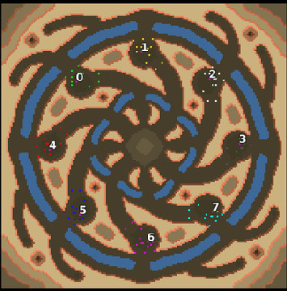 | [Mero_Hypnosis](/assets/49/) | 8 | 3.1.0 | Merowingg | 2013-3-26 |
| 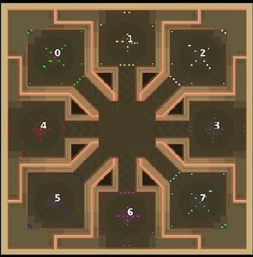 | [Mero_CrazySQR](/assets/50/) | 8 | 3.1.0 | Merowingg | 2013-3-26 |
| 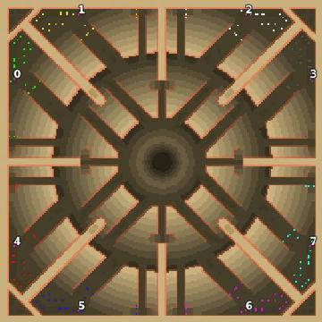 | [Mero_BlackNuke](/assets/51/) | 8 | 3.1.0 | Merowingg | 2013-3-26 |
| 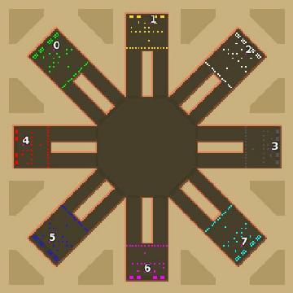 | [Mero_MoonlitSQR](/assets/52/) | 8 | 3.1.0 | Merowingg | 2013-3-26 |
| 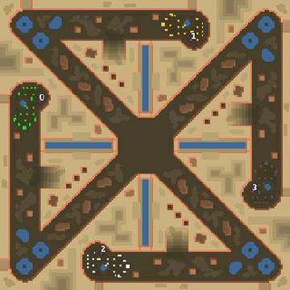 | [Mero_StrangeGoo](/assets/53/) | 4 | 3.1.0 | Merowingg | 2013-3-26 |
|  | [Mero_Cyclops](/assets/54/) | 2 | 3.1.0 | Merowingg | 2013-3-26 |
| 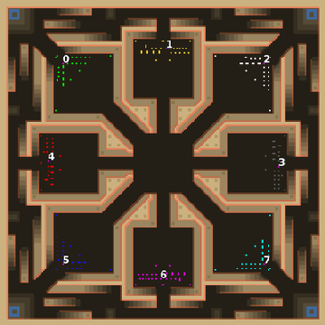 | [Mero_TacticalSQR](/assets/55/) | 8 | 3.1.0 | Merowingg | 2013-3-26 |
| 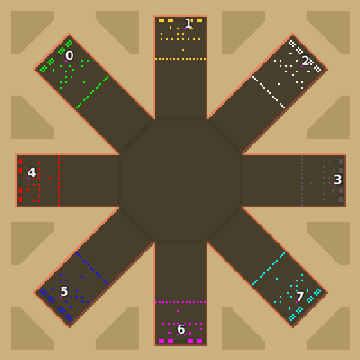 | [Mero_SunnySQR](/assets/56/) | 8 | 3.1.0 | Merowingg | 2013-3-26 |
| 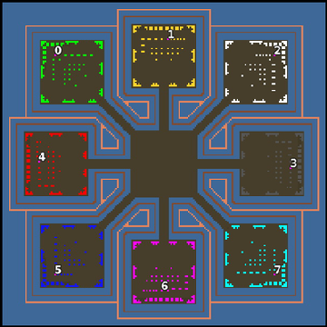 | [Mero_WaterSQR](/assets/59/) | 8 | 3.1.0 | Merowingg | 2013-3-27 |
| 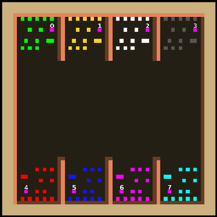 | [Mero_NTWBox](/assets/61/) | 8 | 3.1.0 | Merowingg | 2013-3-27 |
| 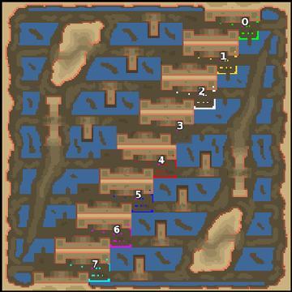 | [Mero_WarLine](/assets/62/) | 8 | 3.1.0 | Merowingg | 2013-3-27 |
| 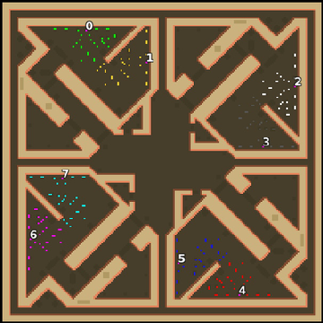 | [Mero_Triangular](/assets/63/) | 8 | 3.1.0 | Merowingg | 2013-3-27 |
| 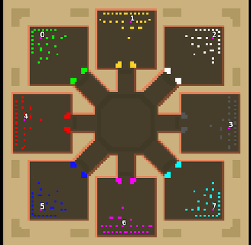 | [Mero_MiniSQR](/assets/64/) | 8 | 3.1.0 | Merowingg | 2013-3-27 |
| 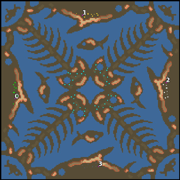 | [Mero_Fishes](/assets/65/) | 4 | 3.1.0 | Merowingg | 2013-3-27 |
|  | [Mero_Bacteria](/assets/66/) | 4 | 3.1.0 | Merowingg | 2013-3-27 |
| 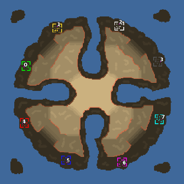 | [Mero_CapriXX](/assets/67/) | 8 | 3.1.0 | Merowingg | 2013-3-27 |
| 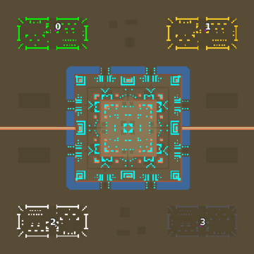 | [Mero_ScavCityX](/assets/68/) | 4 | 3.1.0 | Merowingg | 2013-3-27 |
| 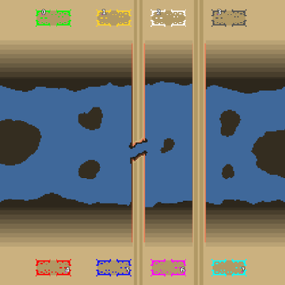 | [Mero_BridgesXX](/assets/73/) | 8 | 3.1.0 | Merowingg | 2013-4-4 |
|  | [Mero_NTWSnakes](/assets/74/) | 8 | 3.1.0 | Merowingg | 2013-3-31 |
| 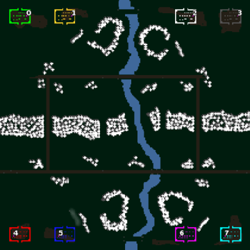 | [Mero_MountainsXX](/assets/75/) | 8 | 3.1.0 | Merowingg | 2013-3-31 |
|  | [Mero_RiverXX](/assets/76/) | 8 | 3.1.0 | Merowingg | 2013-3-31 |
| 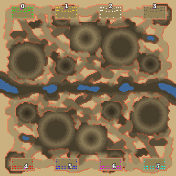 | [Mero_Meteors](/assets/77/) | 8 | 3.1.0 | Merowingg | 2013-3-31 |
| 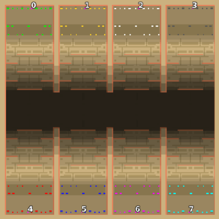 | [Mero_NTWForts](/assets/78/) | 8 | 3.1.0 | Merowingg | 2013-3-31 |
| 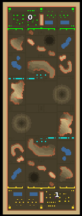 | [Mero_NTWHermit](/assets/79/) | 2 | 3.1.0 | Merowingg | 2013-3-31 |
|  | [Mero_Star](/assets/80/) | 8 | 3.1.0 | Merowingg | 2013-3-31 |
| 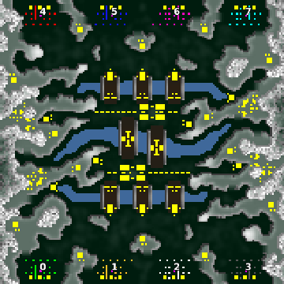 | [DA-fjordz](/assets/81/) | 8 | 3.1.0 | duda | 2013-3-31 |
|  | [DA-scav-isle](/assets/82/) | 9 | 3.1.0 | duda | 2013-3-31 |
|  | [DA-gr-canyon](/assets/83/) | 8 | 3.1.0 | duda | 2013-3-31 |
| 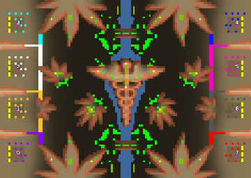 | [DA-medical](/assets/84/) | 8 | 3.1.0 | duda | 2013-3-31 |
| 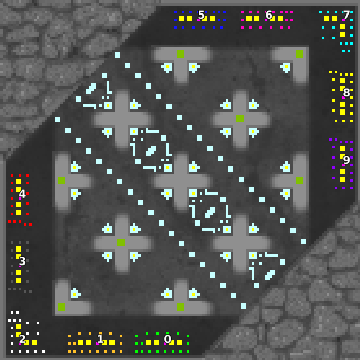 | [DA-plus](/assets/85/) | 10 | 3.1.0 | duda | 2013-3-31 |
| 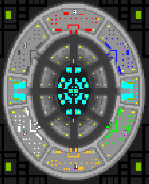 | [DA-miniaena](/assets/86/) | 6 | 3.1.0 | duda | 2013-3-31 |
|  | [DA-oilarena-v1](/assets/87/) | 10 | 3.1.0 | duda | 2013-3-31 |
| 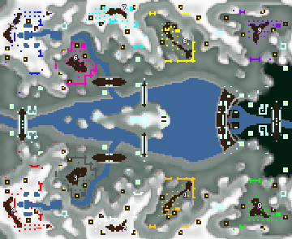 | [DA-mlake](/assets/88/) | 10 | 3.1.0 | duda | 2013-3-31 |
| 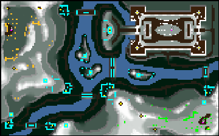 | [DA-castle-b3](/assets/89/) | 3 | 3.1.0 | duda | 2013-3-31 |
| 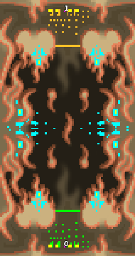 | [DA-firefight1x1](/assets/90/) | 2 | 3.1.0 | duda | 2013-3-31 |
| 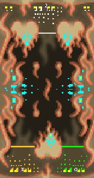 | [DA-firefight1x2](/assets/91/) | 3 | 3.1.0 | duda | 2013-4-1 |
|  | [DA-firefight2x2](/assets/92/) | 4 | 3.1.0 | duda | 2013-4-1 |
|  | [DA-firefight2x3](/assets/93/) | 5 | 3.1.0 | duda | 2013-4-1 |
|  | [DA-firefight3x3](/assets/94/) | 6 | 3.1.0 | duda | 2013-3-31 |
|  | [DA-firefight3x4](/assets/95/) | 7 | 3.1.0 | duda | 2013-4-1 |
|  | [DA-firefight4x4](/assets/96/) | 8 | 3.1.0 | duda | 2013-3-31 |
|  | [DA-firefight4x5](/assets/97/) | 9 | 3.1.0 | duda | 2013-4-1 |
|  | [DA-firefight5x5](/assets/98/) | 10 | 3.1.0 | duda | 2013-4-1 |
|  | [Ts-MEXICO](/assets/99/) | 6 | 3.1.0 | Virus- A | 2013-4-1 |
|  | [Teamwork](/assets/100/) | 8 | 3.1.0 | Virus- A | 2013-4-1 |
|  | [Kasper](/assets/101/) | 4 | 3.1.0 | Virus- A | 2013-4-1 |
|  | [Kasper-crooked](/assets/102/) | 4 | 3.1.0 | Virus- A | 2013-4-1 |
