> [!TIP]
> **If you want maps or mods for the latest version of Warzone 2100, please visit:**
> - **[The Warzone 2100 Maps Database](https://maps.wz2100.net)**

----------------------------------

# Archived Old Maps

## Maps:

[Page 1](/oldmaps-1.md) | **Page 2** | [Page 3](/oldmaps-3.md)

> [!IMPORTANT]
> The following maps are in old map formats intended for old versions of WZ.  
> **Updated versions of maps are available in the Warzone 2100 Maps Database.**

| Preview | Title | Players | Game Version | Author | Created |
| ------- | ----- | ------- | ------------ | ------ | ------- |
|  | [Waste-stream](/assets/103/) | 4 | 3.1.0 | Virus- A | 2013-4-1 |
|  | [beetles](/assets/104/) | 6 | 3.1.0 | Virus- A | 2013-4-1 |
|  | [butterfly](/assets/105/) | 8 | 3.1.0 | Virus- A | 2013-4-1 |
| 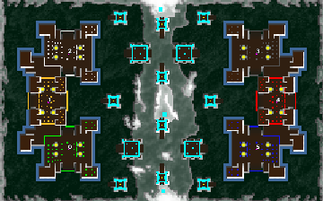 | [DA-towers](/assets/108/) | 6 | 3.1.0 | duda | 2013-4-2 |
|  | [Estrellas-Malas](/assets/109/) | 4 | 3.1.0 | Virus- A | 2013-4-2 |
|  | [Viborillas](/assets/111/) | 4 | 3.1.0 | Virus- A | 2013-4-2 |
|  | [DA-mt-ray](/assets/113/) | 10 | 3.1.0 | duda | 2013-4-3 |
| 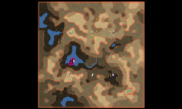 | [JCDG_Nowhere](/assets/115/) | 7 | 3.1.0 | Amiral JCDG | 2013-4-6 |
|  | [WastedLands](/assets/116/) | 4 | 3.1.0 | Berg | 2013-4-15 |
|  | [Freezing](/assets/118/) | 4 | 3.1.0 | NoQ | 2013-4-7 |
|  | [Mero_VTOLSWars](/assets/119/) | 8 | 3.1.0 | Merowingg | 2013-4-8 |
|  | [Mero_Faces](/assets/120/) | 4 | 3.1.0 | Merowingg | 2013-4-8 |
|  | [Mero_Arena](/assets/121/) | 8 | 3.1.0 | Merowingg | 2013-4-8 |
| 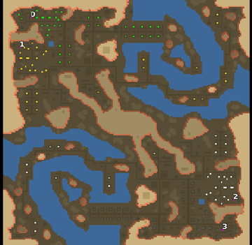 | [Mero_Airport](/assets/122/) | 4 | 3.1.0 | Merowingg | 2013-4-8 |
|  | [Mero_NTWCanyon](/assets/123/) | 8 | 3.1.0 | Merowingg | 2013-4-8 |
| 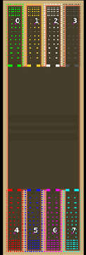 | [Mero_NTWPath](/assets/124/) | 8 | 3.1.0 | Merowingg | 2013-4-8 |
|  | [Orion](/assets/125/) | 10 | 3.1.0 | sensor | 2013-4-12 |
|  | [Polarity](/assets/127/) | 2 | 3.1.0 | NoQ | 2013-4-13 |
|  | [Urban Mystery](/assets/128/) | 2 | 3.1.0 | NoQ | 2013-4-13 |
|  | [Team_Allies](/assets/131/) | 6 | 3.1.0 | sensor | 2013-4-14 |
|  | [Betelgeuse_V1](/assets/132/) | 4 | 3.1.0 | sensor | 2013-4-14 |
|  | [S_Base_V2](/assets/133/) | 8 | 3.1.0 | sensor | 2013-4-15 |
|  | [Tapeworm](/assets/134/) | 2 | 3.1.0 | sensor | 2013-4-16 |
|  | [Blizzard](/assets/135/) | 4 | 3.1.0 | NoQ | 2013-4-17 |
|  | [Progress](/assets/136/) | 5 | 3.1.0 | NoQ | 2013-4-17 |
| 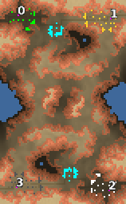 | [Clash](/assets/137/) | 4 | 3.1.0 | NoQ | 2013-4-17 |
| 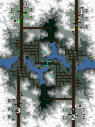 | [Village](/assets/138/) | 4 | 3.1.0 | NoQ | 2013-4-17 |
| 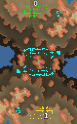 | [Calamity](/assets/139/) | 2 | 3.1.0 | NoQ | 2013-4-17 |
| 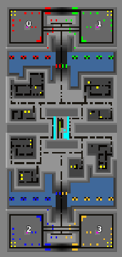 | [Arena #14](/assets/140/) | 4 | 3.1.0 | Olrox | 2013-4-19 |
| 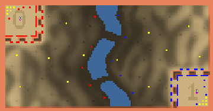 | [Arena #22](/assets/141/) | 2 | 3.1.0 | Olrox | 2013-4-26 |
|  | [Garond Valley](/assets/142/) | 4 | 3.1.0 | Olrox | 2013-4-19 |
| 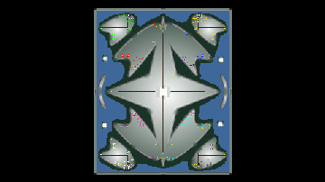 | [Port](/assets/143/) | 8 | 3.1.0 | sensor | 2013-4-19 |
| 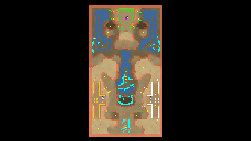 | [Sector_G1](/assets/145/) | 3 | 3.1.0 | sensor | 2013-4-19 |
|  | [10c-DA-europe](/assets/146/) | 10 | 3.1.0 | duda | 2013-4-19 |
|  | [6c-DA-europe](/assets/147/) | 6 | 3.1.0 | duda | 2013-4-19 |
| 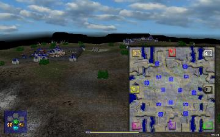 | [NoMansLand](/assets/152/) | 8 | 3.1.0 | Berg | 2013-4-24 |
|  | [Mero_NTWRoad](/assets/153/) | 8 | 3.1.0 | Merowingg | 2013-4-24 |
| 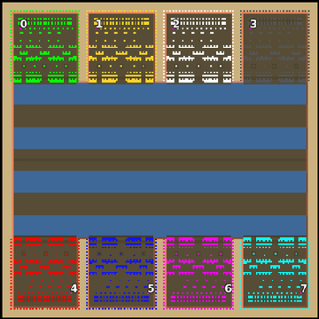 | [Mero_NTWSiren](/assets/154/) | 8 | 3.1.0 | Merowingg | 2013-4-24 |
|  | [Mero_Claws](/assets/155/) | 4 | 3.1.0 | Merowingg | 2013-4-24 |
|  | [Mero_Arrows](/assets/156/) | 8 | 3.1.0 | Merowingg | 2013-4-24 |
|  | [Mero_NTWSpy](/assets/158/) | 8 | 3.1.0 | Merowingg | 2013-4-25 |
|  | [Mero_TallGrass](/assets/159/) | 8 | 3.1.0 | Merowingg | 2013-4-25 |
|  | [Mero_WaterCog](/assets/160/) | 8 | 3.1.0 | Merowingg | 2013-4-25 |
|  | [Mero_Lake](/assets/161/) | 2 | 3.1.0 | Merowingg | 2013-4-25 |
| 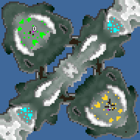 | [Serenity](/assets/162/) | 2 | 3.1.0 | NoQ | 2013-4-27 |
|  | [Arid](/assets/163/) | 6 | 3.1.0 | NoQ | 2013-4-27 |
| 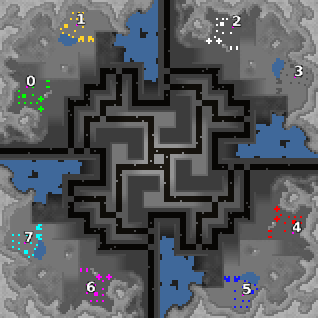 | [Rush Hour](/assets/164/) | 8 | 3.1.0 | NoQ | 2013-4-27 |
| 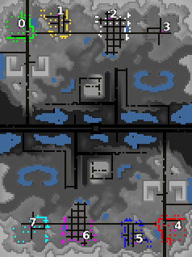 | [Abandoned](/assets/165/) | 8 | 3.1.0 | NoQ | 2013-4-27 |
|  | [Whirlpool](/assets/167/) | 4 | 3.1.0 | NoQ | 2013-4-27 |
| 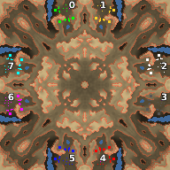 | [The Source](/assets/168/) | 8 | 3.1.0 | NoQ | 2013-4-27 |
| 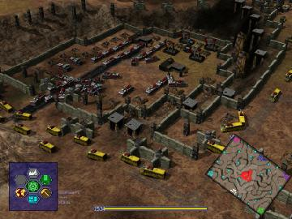 | [Rock Plain](/assets/169/) | 6 | 3.1.0 | Charca | 2013-4-28 |
| 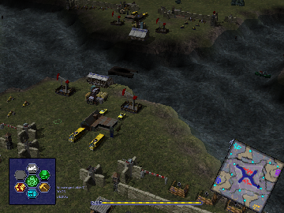 | [Scavenger Lake](/assets/170/) | 4 | 3.1.0 | Charca | 2013-11-23 |
|  | [Mero_NTWHunter](/assets/171/) | 8 | 3.1.0 | Merowingg | 2013-5-2 |
| 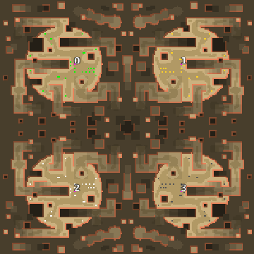 | [Mero_DeathZone](/assets/172/) | 4 | 3.1.0 | Merowingg | 2013-5-2 |
| 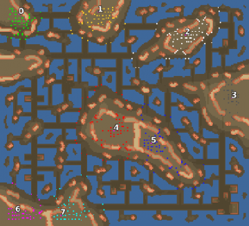 | [Mero_AsphaltSea](/assets/173/) | 8 | 3.1.0 | Merowingg | 2013-5-2 |
|  | [Mero_NTWClown](/assets/175/) | 8 | 3.1.0 | Merowingg | 2013-5-4 |
| 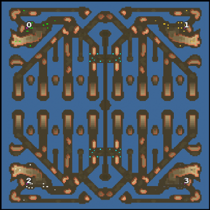 | [Mero_WaterJaws](/assets/176/) | 4 | 3.1.0 | Merowingg | 2013-5-4 |
| 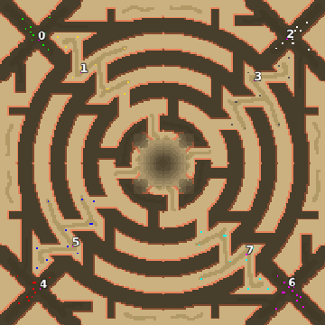 | [Mero_Tornado](/assets/177/) | 8 | 3.1.0 | Merowingg | 2013-5-4 |
|  | [Mero_BlackCat](/assets/178/) | 8 | 3.1.0 | Merowingg | 2013-5-4 |
|  | [Mero_Chaos](/assets/182/) | 8 | 3.1.0 | Merowingg | 2013-5-7 |
| 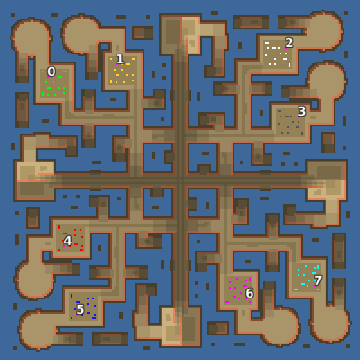 | [Mero_WarPaths](/assets/183/) | 8 | 3.1.0 | Merowingg | 2013-5-7 |
| 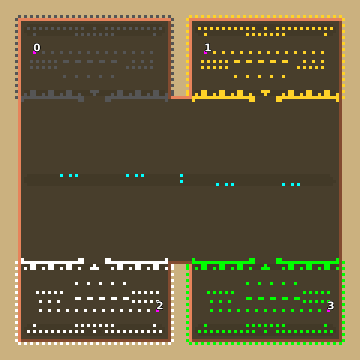 | [Mero_NTWPrince](/assets/184/) | 4 | 3.1.0 | Merowingg | 2013-5-7 |
| 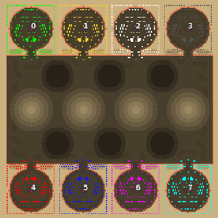 | [Mero_NTWWizard](/assets/185/) | 8 | 3.1.0 | Merowingg | 2013-5-7 |
|  | [Confrontation](/assets/186/) | 2 | 3.1.0 | NoQ | 2013-5-8 |
| 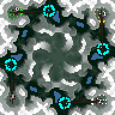 | [Mist](/assets/187/) | 4 | 3.1.0 | NoQ | 2013-5-8 |
| 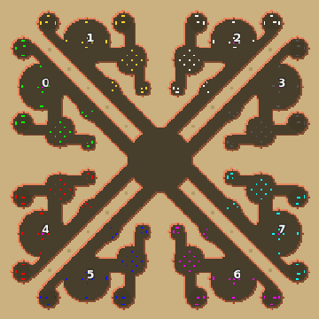 | [Mero_Mantis](/assets/188/) | 8 | 3.1.0 | Merowingg | 2013-5-17 |
| 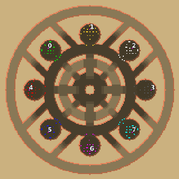 | [Mero_Revolver](/assets/189/) | 8 | 3.1.0 | Merowingg | 2013-5-17 |
|  | [Mero_NastyNet](/assets/190/) | 4 | 3.1.0 | Merowingg | 2013-5-17 |
|  | [Mero_Factory](/assets/191/) | 4 | 3.1.0 | Merowingg | 2013-5-17 |
|  | [Mero_Rotation](/assets/192/) | 4 | 3.1.0 | Merowingg | 2013-5-17 |
|  | [Mero_NTWKingV2](/assets/193/) | 8 | 3.1.0 | Merowingg | 2013-5-18 |
| 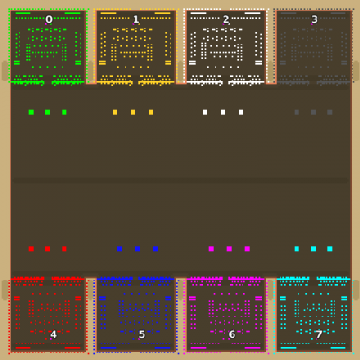 | [Mero_NTWQueen](/assets/194/) | 8 | 3.1.0 | Merowingg | 2013-5-18 |
| 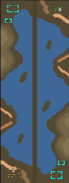 | [Mero_HellRoad](/assets/195/) | 2 | 3.1.0 | Merowingg | 2013-5-18 |
|  | [Mero_Fortresses](/assets/196/) | 4 | 3.1.0 | Merowingg | 2013-5-18 |
| 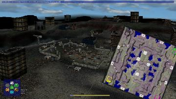 | [Scavenger Dawn](/assets/197/) | 4 | 3.1.0 | Berg | 2013-5-20 |
|  | [Encounter](/assets/199/) | 4 | 3.1.0 | NoQ | 2013-6-2 |
