> [!TIP]
> **If you want maps or mods for the latest version of Warzone 2100, please visit:**
> - **[The Warzone 2100 Maps Database](https://maps.wz2100.net)**

----------------------------------

# Archived Old Maps

## Maps:

[Page 1](/oldmaps-1.md) | [Page 2](/oldmaps-2.md) | **Page 3**

> [!IMPORTANT]
> The following maps are in old map formats intended for old versions of WZ.  
> **Updated versions of maps are available in the Warzone 2100 Maps Database.**

| Preview | Title | Players | Game Version | Author | Created |
| ------- | ----- | ------- | ------------ | ------ | ------- |
| 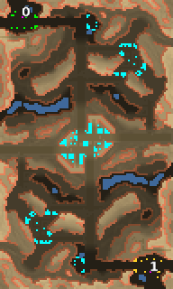 | [Deserted](/assets/200/) | 2 | 3.1.0 | NoQ | 2013-6-2 |
| 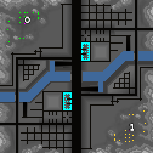 | [Highway](/assets/201/) | 2 | 3.1.0 | NoQ | 2013-6-2 |
| 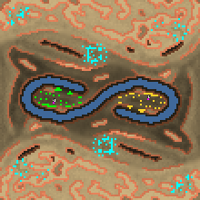 | [Infinity](/assets/202/) | 2 | 3.1.0 | NoQ | 2013-6-2 |
|  | [Strikeout](/assets/203/) | 2 | 3.1.0 | NoQ | 2013-6-2 |
| 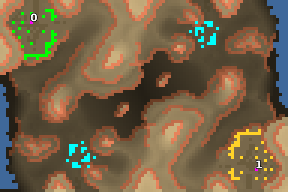 | [Sunlight](/assets/204/) | 2 | 3.1.0 | NoQ | 2013-6-2 |
|  | [Artifact](/assets/205/) | 4 | 3.1.0 | NoQ | 2013-6-2 |
|  | [Middle Of Nowhere](/assets/206/) | 4 | 3.1.0 | NoQ | 2013-6-2 |
|  | [Urban Twirl](/assets/207/) | 4 | 3.1.0 | NoQ | 2013-6-2 |
|  | [Vision X2](/assets/208/) | 4 | 3.1.0 | NoQ | 2013-6-2 |
|  | [Rubber](/assets/210/) | 6 | 3.1.0 | NoQ | 2013-6-2 |
|  | [Snowfall](/assets/211/) | 6 | 3.1.0 | NoQ | 2013-6-2 |
|  | [Disaster](/assets/212/) | 7 | 3.1.0 | NoQ | 2013-6-2 |
|  | [Island 8](/assets/213/) | 8 | 3.1.0 | NoQ | 2013-6-2 |
|  | [Garden](/assets/214/) | 4 | 3.1.0 | NoQ | 2013-6-2 |
|  | [DA-BDCTW10-v1max](/assets/215/) | 10 | 3.1.0 | duda | 2013-6-6 |
|  | [DA-bahrain](/assets/216/) | 9 | 3.1.0 | duda | 2013-6-9 |
| 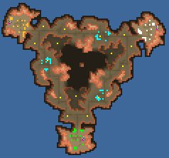 | [Gamma](/assets/218/) | 3 | 3.1.0 | NoQ | 2013-6-19 |
| 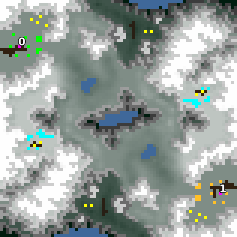 | [Clean](/assets/224/) | 2 | 3.1.0 | NoQ | 2013-7-28 |
|  | [Mero_Spaghetti](/assets/225/) | 2 | 3.1.0 | Merowingg | 2013-7-28 |
| 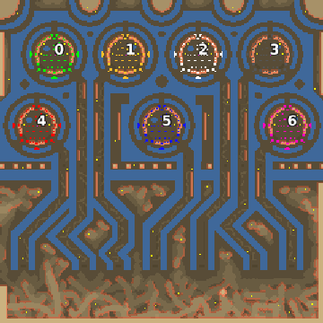 | [Mero_SevenLords](/assets/226/) | 7 | 3.1.0 | Merowingg | 2013-8-6 |
| 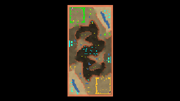 | [Enum](/assets/227/) | 2 | 3.1.0 | sensor | 2013-8-21 |
| 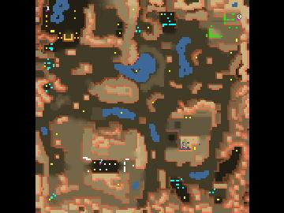 | [Exploration](/assets/229/) | 4 | 3.1.0 | IJustDontCare | 2013-9-1 |
|  | [NavalPort](/assets/230/) | 6 | 3.1.0 | IJustDontCare | 2013-9-1 |
| 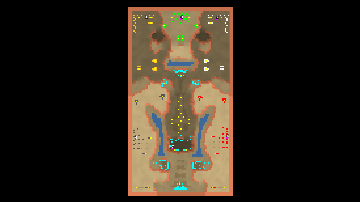 | [Forceps](/assets/231/) | 5 | 3.1.0 | sensor | 2013-9-2 |
| 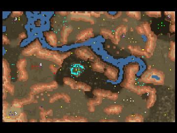 | [Aftermath](/assets/232/) | 6 | 3.1.0 | IJustDontCare | 2013-9-5 |
| 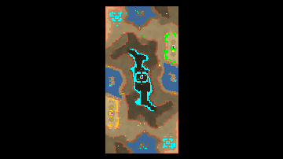 | [Sepi](/assets/233/) | 2 | 3.1.0 | sensor | 2013-9-29 |
| 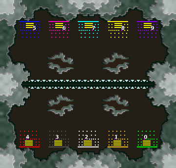 | [DA-julia-10-v1](/assets/234/) | 10 | 3.1.0 | duda | 2013-10-7 |
|  | [DA-julia-8-v1](/assets/235/) | 8 | 3.1.0 | duda | 2013-10-7 |
|  | [DA-julia-6-v1 ](/assets/236/) | 6 | 3.1.0 | duda | 2013-10-7 |
| 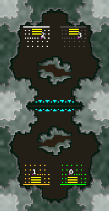 | [DA-julia-4-v1](/assets/237/) | 4 | 3.1.0 | duda | 2013-10-7 |
| 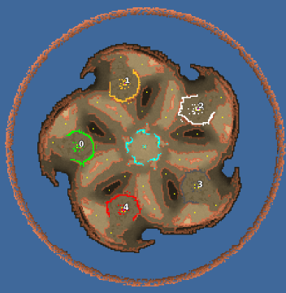 | [hydrofin](/assets/239/) | 5 | 3.1.0 | Mysteryem | 2013-11-8 |
|  | [Hendeka](/assets/240/) | 10 | 3.1.0 | Mysteryem | 2013-11-8 |
| 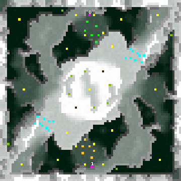 | [IvySummit](/assets/241/) | 2 | 3.1.0 | Mysteryem | 2013-11-8 |
|  | [DustOff](/assets/242/) | 2 | 3.1.0 | Mysteryem | 2013-11-8 |
|  | [Arizatec4](/assets/243/) | 4 | 3.1.0 | Mysteryem | 2013-11-9 |
|  | [Arizatec6](/assets/244/) | 6 | 3.1.0 | Mysteryem | 2013-11-9 |
|  | [OutskirtsM](/assets/245/) | 2 | 3.1.0 | Mysteryem | 2013-11-9 |
|  | [Frostblade](/assets/246/) | 4 | 3.1.0 | Mysteryem | 2013-11-10 |
|  | [TheGrid](/assets/247/) | 8 | 3.1.0 | Mysteryem | 2013-11-10 |
| 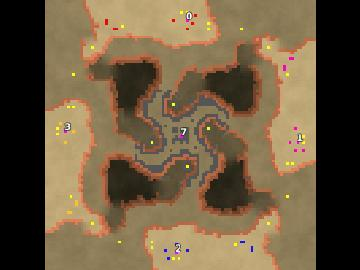 | [Carcha Whirl](/assets/248/) | 4 | 3.1.0 | Charca | 2013-11-22 |
|  | [DA-towers8v0](/assets/256/) | 8 | 3.1.1 | duda | 2014-1-10 |
| 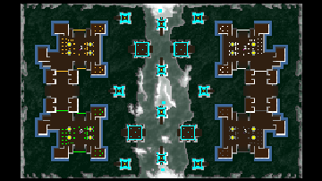 | [DA-towers4v0](/assets/257/) | 4 | 3.1.1 | duda | 2014-1-15 |
|  | [DA-towers10v0](/assets/259/) | 10 | 3.1.1 | duda | 2014-1-24 |
|  | [trails](/assets/260/) | 6 | 3.1.1 | tmp500 | 2014-1-28 |
|  | [Trickery Treat](/assets/261/) | 10 | 3.1.1 | tmp500 | 2014-7-20 |
|  | [NovaTown](/assets/262/) | 4 | 3.1.1 | Mysteryem | 2014-2-3 |
|  | [Invaders](/assets/263/) | 2 | 3.1.1 | NoQ | 2014-2-6 |
|  | [Mero_SideEffects](/assets/265/) | 6 | 3.1.1 | Merowingg | 2014-5-4 |
|  | [Mero_Centipede](/assets/266/) | 8 | 3.1.1 | Merowingg | 2014-5-4 |
|  | [Mero_Woodlouse](/assets/267/) | 8 | 3.1.1 | Merowingg | 2014-5-4 |
|  | [Mero_Crocodile](/assets/268/) | 8 | 3.1.1 | Merowingg | 2014-5-4 |
| 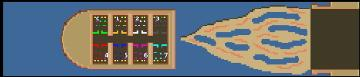 | [Mero_Bullet](/assets/269/) | 8 | 3.1.1 | Merowingg | 2014-5-18 |
| 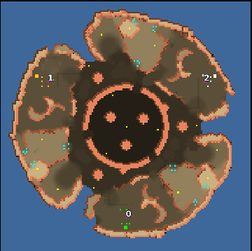 | [trefoil](/assets/270/) | 3 | 3.1.1 | montetank | 2014-6-1 |
| 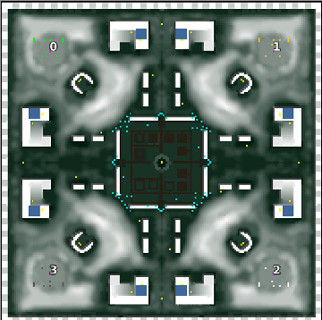 | [Iceage](/assets/271/) | 4 | 3.1.1 | montetank | 2014-6-1 |
|  | [smilingthird](/assets/272/) | 4 | 3.1.1 | montetank | 2014-5-31 |
| 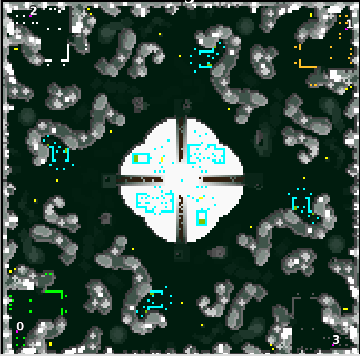 | [MontenegroB](/assets/273/) | 4 | 3.1.1 | montetank | 2014-6-1 |
|  | [OKcorral](/assets/274/) | 4 | 3.1.1 | montetank | 2014-6-1 |
| 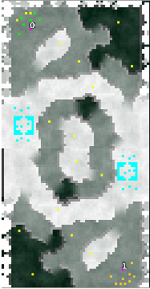 | [Winteragony](/assets/275/) | 2 | 3.1.1 | montetank | 2014-6-1 |
|  | [Quickwinter](/assets/276/) | 4 | 3.1.1 | montetank | 2014-6-1 |
| 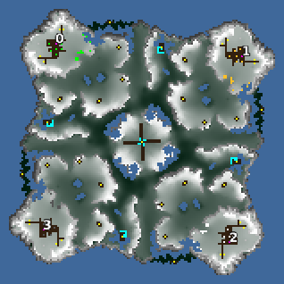 | [Fantastic](/assets/279/) | 4 | 3.1.1 | NoQ | 2014-9-13 |
|  | [TwinArrowHeads](/assets/282/) | 2 | 3.1.1 | bendib | 2014-11-2 |
| 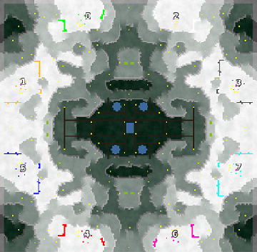 | [Forestcity](/assets/283/) | 8 | 3.1.1 | montetank | 2014-11-20 |
|  | [Thales](/assets/284/) | 7 | 3.1.1 | montetank | 2014-12-5 |
|  | [Pentagonscavs](/assets/285/) | 5 | 3.1.1 | montetank | 2014-12-28 |
|  | [Mero_LitleMob](/assets/286/) | 4 | 3.1.1 | Merowingg | 2015-1-4 |
|  | [9c-BrooksRange](/assets/287/) | 9 | 3.1.2 | montetank | 2015-1-9 |
| 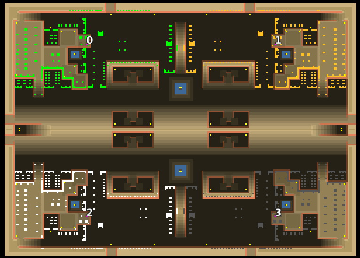 | [Mero_TanksWars](/assets/288/) | 4 | 3.1.1 | Merowingg | 2015-1-11 |
|  | [RatIsland](/assets/289/) | 3 | 3.1.2 | montetank | 2015-1-19 |
| 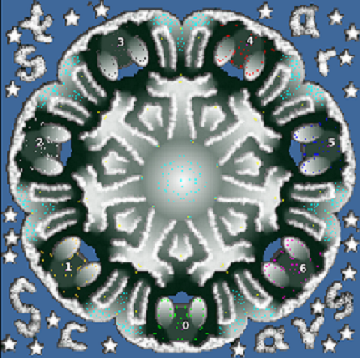 | [Starscavs](/assets/293/) | 7 | 3.1.2 | montetank | 2015-2-18 |
|  | [World Domination V12](/assets/295/) | 6 | 3.1.3 | stealthx | 2016-2-2 |
| 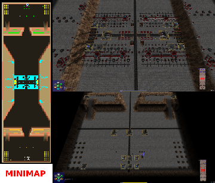 | [DO-FortScavWar2p](/assets/300/) | 2 | 3.1.5 | Doruletz | 2017-1-16 |
| 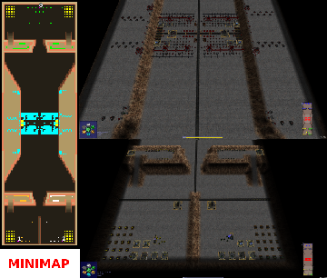 | [DO-FortScavWar3p](/assets/301/) | 3 | 3.1.5 | Doruletz | 2017-1-16 |
|  | [DO-FortScavWar4p](/assets/302/) | 4 | 3.1.5 | Doruletz | 2017-1-16 |
| 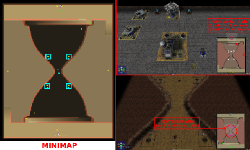 | [Hourglass-LowOil](/assets/303/) | 2 | 3.1.5 | Doruletz | 2017-9-30 |
| 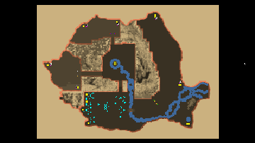 | [DO-Romania](/assets/304/) | 6 | 3.1.5 | Doruletz | 2017-3-13 |
| 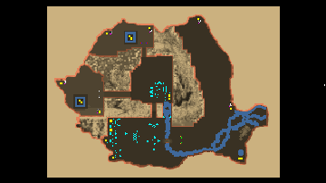 | [DO-Romania-2v2v2](/assets/305/) | 6 | 3.1.5 | Doruletz | 2017-3-14 |
| 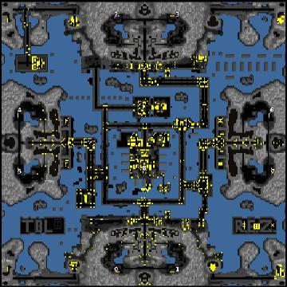 | [The Battlelands (TBL) V2.0](/assets/312/) | 8 | 3.1.5 | REZ | 2017-9-26 |
